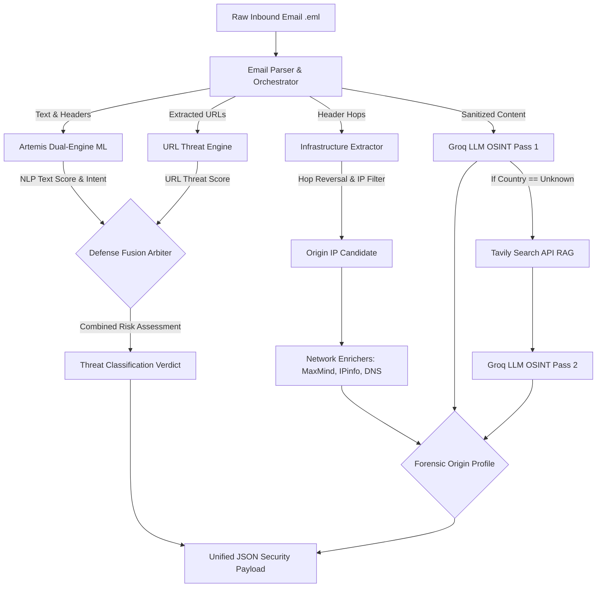

# Unified Email Threat Intelligence & Traceability Architecture

## 1. Project Overview & Executive Summary

This project is a comprehensive, enterprise-grade **Unified Email Threat Intelligence & Forensic Attribution Suite**. It solves two of the most complex challenges in modern cybersecurity:
1. **Adversarial & LLM-Generated Phishing (Artemis)**: Detecting zero-day phishing, malware, and BEC attacks that bypass traditional filters using sophisticated grammar or obfuscation.
2. **Origin Traceability & Attribution (Pending/Future Expansion)**: Accurately tracing the true origin of an email and detecting malicious infrastructure spoofing, bypassing server-side IP masking by major webmail providers (Google/Microsoft).

By unifying a **Multi-Modal Dual-Engine Classification Pipeline** with an **Adaptive OSINT Traceability Engine**, this suite provides an end-to-end security verdict—from deep text analysis and URL scanning to geographic forensic attribution.

---

## 2. System Architecture & Flowchart



---

## 3. Artemis: Multi-Layer Defense-in-Depth Architecture

Modern email security cannot rely on a single bag-of-words machine learning model. Attackers use Large Language Models (LLMs) to generate flawless, polite business emails that evade simple filters. Artemis implements a **Multi-Layer Defense Gateway**:

### Layer 1: Statistical Dual-Engine Soft-Voting Ensemble
* **Legacy Engine**: Trained on 150,000 historic emails to catch traditional threats.
* **Modern Engine**: Trained on newly generated synthetic emails to catch LLM-based attacks.
* **Asymmetric Voting**: The arrays from both engines are combined using a 40% Legacy / 60% Modern split.
* **Overfitting Safeguards**: Uses `L2-regularized LinearSVC` and strict TF-IDF constraints (`sublinear_tf=True`, `min_df=2`, `max_df=0.75`).

### Layer 2: Semantic Threat & Behavioral Intent Arbiter
Maps adversarial intent to the **MITRE ATT&CK** framework:
* **BEC & Wire Fraud (T1566.001 - Critical)**: Diverts wire transfers, changes routing.
* **Credential Harvesting (T1566.002 - Critical)**: Urgency countdowns, identity verification links.
* **Commercial Spam (T1598 - Low)**: Prescription drugs, penny stock pumping.

### Layer 3: Multi-Modal URL Threat Fusion Engine
Extracts URLs from the email body and passes them to a deep structural URL classifier.
* **Malware Override**: If the URL hosts malware, the email escalates to `phishing` at 99.99% confidence.
* **Phishing Synergy**: Moderate text risk + a credential harvesting URL = Confirmed Phishing.

---

## 4. Origin Traceability & Forensic Attribution (Context 1)

*Note: This section outlines the forensic attribution components of the project designed to counter server-side IP masking (anchoring bias).*

### A. Infrastructure Extraction (`extractor.py`)
- **Hop Reversal**: Reverses `Received:` headers to walk the path chronologically.
- **Trust Filtering**: Evaluates hops against internal network definitions (RFC 1918) to find the first external public IP.

### B. Network & Domain Intelligence (`enrichers.py`)
- **Local Geolocation**: Uses offline MaxMind GeoLite2 databases to prevent API rate limits.
- **Proxy Detection**: Queries IPinfo API to identify VPNs, Tor nodes, and datacenters.
- **Domain Hygiene**: Resolves MX, SPF (`v=spf1`), DMARC, and WHOIS age.

### C. OSINT Engine & Adaptive RAG (`orchestrator.py`)
- **Content Sanitization**: Strips LLM datacenter anchoring bias (IPs/Headers).
- **Groq Evaluation (`qwen3.8-27b`)**: Scans for timezones, currencies, dialects, and dialing codes.
- **Tavily RAG Fallback**: If the origin is "Unknown," it pulls live contextual web snippets to augment the LLM's second pass.

---

## 5. Structured JSON Output Payload

The final output of the suite is a highly transparent JSON payload. Below is the exact schema and explanation of the data delivered to analysts:

* **`status`**: The definitive verdict (`safe`, `spam`, `phishing`, `malware`).
* **`threat_intelligence`**: MITRE ATT&CK mapping (`technique_id`, `technique_name`, `severity`).
* **`explainable_ai` (XAI)**: Exact tokens (e.g., "routing", "remittance") that triggered the ML model, mapped mathematically via dot-products.
* **`adversarial_defense`**: Telemetry on obfuscation attempts (e.g., zero-width spaces removed, homoglyphs normalized).
* **`class_probabilities`**: Exact confidence percentages (0-100 format) across categories.
* **`analysis_summary`**: Human-readable explanation and `key_factors` for why the email was flagged.
* **`mathematical_breakdown`**: Complete audit trail showing the Legacy vs. Modern vote split, baseline NLP scores, and any `security_policy_override`.
* **`extracted_urls` & `detailed_url_analysis`**: The exact URLs identified, alongside their independent threat evaluations and LightGBM margin calculations.

*(Pending integration: `origin_profile` containing geolocation, asn, and llm_prediction objects from the Traceability suite).*

---

## 6. Evaluation & Benchmark Performance

The Artemis Dual-Engine classification model was rigorously tested against numerous unseen, highly-evasive datasets.

* **100% Accuracy Benchmarks**: 
  * `test_set_50.csv` (50 samples): 100%
  * `test_set_50_v2.csv` (50 samples): 100%
  * `t5.csv` (30 samples): 100%
* **High-Difficulty Validation**:
  * `t7.csv` (40 samples): 97.50%
  * `External Benchmark 1 Optimized` (60 samples): 98.33%
  * `80-Sample Suite` (80 samples): 91.25%

---

## 7. Presentation & Pitch Guide (Hackathon Talking Points)

When feeding this document to an AI to generate a pitch deck or when presenting to technical judges, utilize these core pillars:

1. **Defending Against Domain Shift (The Dual-Engine Approach)**:
   > "Legacy models fail when attackers use ChatGPT, causing a structural domain shift. We use an asymmetric 40/60 Dual-Engine Soft-Voting ensemble to maintain historical robustness while prioritizing modern LLM threat detection."

2. **Defending Against Adversarial Bypass (Multi-Layer Architecture)**:
   > "Flawless grammar fools standard ML. Our Semantic Threat Arbiter intercepts behavioral vectors (like remittance diversion) regardless of text polish, and our Multi-Modal URL Engine catches malware links before the user clicks."

3. **Defending Against Anchoring Bias (OSINT Traceability)**:
   > "Google and Microsoft mask sender IPs, causing tools to falsely attribute origins to US datacenters. Our suite utilizes offline MaxMind routing coupled with an adaptive Groq+Tavily LLM RAG agent to forensically pinpoint true geographic origins via dialect and currency clues."

4. **Proactive Explainability (XAI)**:
   > "Unlike black-box models, our system outputs an absolute mathematical audit trail. Analysts see the exact XAI tokens, the ensemble voting breakdown, and the specific MITRE ATT&CK techniques triggered."

---

## 8. URL Threat Engine Guide

# Artemis: Standalone URL Engine Guide

This document provides all the context, architecture details, and mathematical breakdowns for the **Artemis URL Prediction Engine**. It is designed to help you extract the URL component from the main Artemis repository and use it completely independently in another project.

---

### 1. Files Required for Standalone Use
To move the URL Engine to a different project, you **only** need to copy the following files.

#### Core Execution Files
*   `src/url_features.py`: Contains the complex lexical and structural feature extraction logic (e.g., measuring URL length, counting subdomains, checking for trusted platforms, entropy calculations).
*   `src/predict_url.py`: The main inference script. Loads the LightGBM model, applies deterministic safeguards, and outputs the beautifully formatted JSON predictions.

#### Machine Learning Artifacts
*   `models/artemis_url_model.pkl`: The fully trained LightGBM model artifact. *(If you don't copy this, you will need to run the training script below to generate a new one).*

#### Training Data (Optional)
*   `train_url.py`: The script used to train the LightGBM model, balance the dataset, perform cross-validation, and bundle the `.pkl` artifact.
*   `url_dataset.csv`: The massive dataset of URLs used for training (over 630,000 URLs across 4 classes).

---

### 2. Model Architecture

The URL Engine uses a highly tuned **LightGBM (Light Gradient Boosting Machine)**. 

#### Why LightGBM?
Unlike emails, URLs are short and structured. They have extremely dense, specific characteristics (e.g., number of dots, presence of brand names, path depth). LightGBM is a tree-based ensemble learning algorithm that is exceptionally fast and dominant at handling structured, tabular feature data. It builds decision trees leaf-wise, allowing it to capture complex, non-linear patterns in URL structures that simpler models might miss.

#### The Pipeline
1. **Feature Extractor (`url_features.py`)**: Parses the raw URL string into hundreds of distinct numerical features including structural metrics (e.g., `brand_entropy`, `is_trusted_platform`, `subdomain_count`) and an optimized detection matrix for ~300 high-value brand impersonation targets.
2. **LightGBM Model**: Takes the feature array and passes it through an ensemble of 1500 decision trees. It calculates raw margin scores (logits) for four classes: `Benign`, `Phishing`, `Malware`, and `Defacement`.
3. **Softmax Transformation**: The raw logits are passed through an exponential Softmax function to convert them into a normalized percentage distribution (adding up to 100%).
4. **Deterministic Safeguards (`predict_url.py`)**: Before finalizing the output, the engine applies hardcoded safety rules:
    *   **Root Domain Safeguard**: Ensures clean, bare root domains (like `apple.com`) are not falsely flagged as phishing.
    *   **Academic & Government Safeguard**: Ensures verified accredited educational and governmental institutions (`.ac.in`, `.edu`, `.gov`, `.mil`, etc.) are recognized as legitimate and protected against false-positive phishing flags.
    *   **Platform Subdomain Safeguard**: Ensures 2-dot developer subdomains (like `carbon.now.sh` or `project.vercel.app`) are marked as safe, unless they contain highly suspicious keywords (like `login` or `paypal`).

---

### 3. How the Output is Generated

When you run `python src/predict_url.py "https://example.com"`, the script outputs a highly structured JSON response designed to be easily consumed by any Frontend or API.

#### Output JSON Structure
```json
{
  "status": "benign",
  "class_probabilities": {
    "benign": 100.0,
    "defacement": 0.0,
    "malware": 0.0,
    "phishing": 0.0
  },
  "analysis_summary": {
    "headline": "Classified as Benign (Safe)",
    "explanation": "The URL exhibits standard domain parameters with clean lexical features and no indicators of typosquatting or path manipulation.",
    "key_factors": [
      "Valid registered root domain without brand impersonation triggers",
      "Standard path depth and character length ratios",
      "No suspicious Top-Level Domain (TLD) or raw IP hosting"
    ]
  },
  "mathematical_breakdown": {
    "formula": "P(k) = e^(z_k) / Sum(e^(z_j))",
    "raw_logits_z": {
      "benign": -2.946,
      "defacement": -9.506,
      "malware": -3.792,
      "phishing": 0.277
    },
    "exponentials_exp_z": {
      "benign": 0.053,
      "defacement": 0.0,
      "malware": 0.023,
      "phishing": 1.319
    },
    "sum_denominator": 1.394,
    "step_by_step": [
      "Step 1: Gathered raw tree margin scores (logits) from LightGBM ensemble trees.",
      "Step 2: Applied exponential transformation e^(z_k) to eliminate negative values.",
      "Step 3: Summed exponentials and divided to normalize probabilities.",
      "Step 4: Platform Subdomain Safeguard - Probabilities forcefully overridden to benign=100.0%."
    ]
  }
}
```

#### Breakdown of the Output
1. **`status`**: The dominant classification (`benign`, `phishing`, `malware`, or `defacement`).
2. **`class_probabilities`**: The Softmax percentages for all four classes.
3. **`analysis_summary`**: Human-readable explanations ready to be displayed on a dashboard or extension UI.
4. **`mathematical_breakdown`**: The exact ML formulas, raw logits (`z_k`), and Step-by-Step execution (including Safeguard interventions) for total transparency.

---

### 4. Usage in Your New Project

Once you move the files to your new directory, ensure you have the required dependencies (`lightgbm`, `pandas`, `scikit-learn`, `tldextract`) installed, and run the engine exactly as before:

**Test a Safe URL:**
```bash
python predict_url.py "https://carbon.now.sh"
```

**Test a Phishing URL:**
```bash
python predict_url.py "http://paypal-login-verify.now.sh"
```

---

### 5. Hackathon V2 Updates & Metrics

During the latest V2 model retraining, the architecture was drastically scaled up and optimized:

*   **Dataset Scale**: Increased from ~100k to **630,615 fully deduplicated URLs**.
*   **Brand List Optimization**: The brand matching list was surgically reduced from 5,000+ uncurated entries to ~300 core high-value targets (PayPal, Stripe, Google, etc.). This dropped the Levenshtein scan time from 73ms down to 4ms per URL, enabling real-time extraction in production.
*   **OOM Fixes**: Massive memory reductions were added to `train_url.py` via aggressive `int8` downcasting, preventing Out-Of-Memory swap crashes during `train_test_split`.
*   **Performance Metrics**: The V2 LightGBM classifier reached an overall **Accuracy of 93%** on the validation set.
    *   **Phishing F1**: 0.86
    *   **Malware F1**: 0.98
    *   **Defacement F1**: 0.96
    *   **Benign F1**: 0.94

---

## 9. Latest Enhancements: Multi-Modal Synthesized Verdict & Adversarial Telemetry

The Artemis system has been heavily upgraded to synthesize outputs from multiple independent threat engines into a single, cohesive final verdict, explicitly addressing advanced obfuscation techniques.

### A. Adversarial Evasion Telemetry
To combat attackers using unicode tricks to bypass filters, we implemented robust sanitization and telemetry collection:
*   **Zero-Width & Invisible Character Stripping**: Automatically removes formatting characters (e.g., `\u200B`, `\u200C`) meant to disrupt tokenization.
*   **Homoglyph Correction**: Maps lookalike Cyrillic and Greek characters (e.g., `\u0430` to `a`, `\u043E` to `o`) back to their standard Latin equivalents.
*   **PowerShell Unicode Escape Decoding**: Parses and normalizes command-line style unicode escapes (e.g., `` `u{XXXX} ``), ensuring accurate evaluation of inputs pasted from shell environments.
*   **Telemetry Logging**: The system counts and reports the exact number of evasion attempts neutralized, feeding this data into the final verdict to indicate explicit malicious intent.

### B. Explainable AI (XAI) Enhancements
*   Raw SVM/Logistic coefficients are mapped to exact feature tokens.
*   The tokens are presented in the CLI output with human-readable threat contribution percentages (e.g., `Sanitized: hold +21.43%`), demystifying the black-box NLP classification.

### C. Synthesized Final Verdict
The system now automatically generates a highly readable "Conclusion" block at the end of the analysis process. It merges:
1.  **Base Text Analysis**: The raw classification confidence from the NLP ensemble.
2.  **Adversarial Telemetry Impact**: Confirmation if the sender attempted to bypass security filters using obfuscation.
3.  **URL Synergy**: Output from the URL Threat Engine, detailing the presence and severity of malicious links extracted from the body.
This synthesis provides security analysts with a definitive, contextual understanding of *why* the email was flagged, explicitly noting when "coercive social engineering messaging is paired with confirmed malicious/phishing links to execute an attack."```