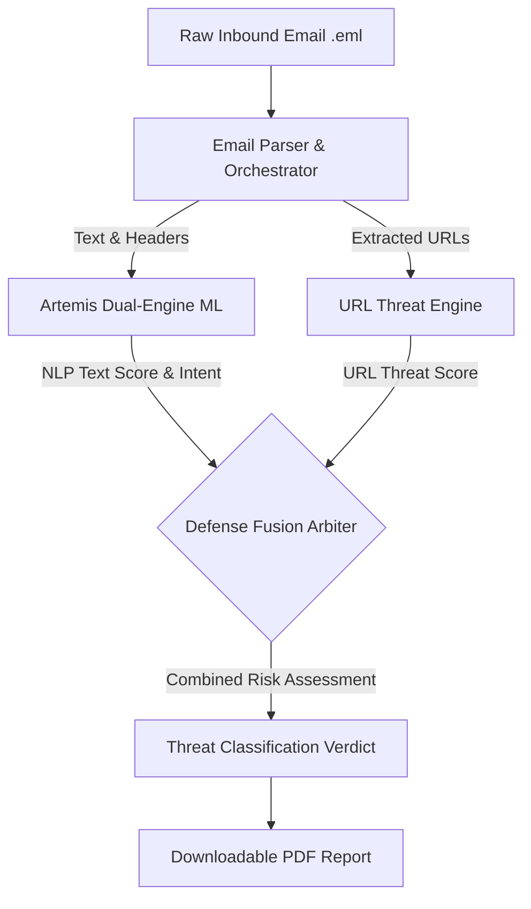

# Artemis: Unified Email & URL Threat Intelligence

## 1. Project Overview & Executive Summary

Artemis is a comprehensive, enterprise-grade **Unified Email Threat Intelligence Suite**. It solves the complex challenge of detecting zero-day phishing, malware, and BEC attacks that bypass traditional filters using sophisticated grammar or obfuscation (Adversarial & LLM-Generated Phishing).

By unifying a **Multi-Modal Dual-Engine Classification Pipeline**, this suite provides an end-to-end security verdict—from deep text analysis and URL scanning to adversarial evasion telemetry.

---

## 2. System Architecture & Flowchart



---

## 3. Artemis: Multi-Layer Defense-in-Depth Architecture

Modern email security cannot rely on a single bag-of-words machine learning model. Attackers use Large Language Models (LLMs) to generate flawless, polite business emails that evade simple filters. Artemis implements a **Multi-Layer Defense Gateway**:

### Layer 1: Statistical Dual-Engine Soft-Voting Ensemble
* **Legacy Engine**: Trained on 150,000 historic emails to catch traditional threats.
* **Modern Engine**: Trained on newly generated synthetic emails to catch LLM-based attacks.
* **Asymmetric Voting**: The arrays from both engines are combined using a 40% Legacy / 60% Modern split.
* **Overfitting Safeguards**: Uses `L2-regularized LinearSVC` and strict TF-IDF constraints (`sublinear_tf=True`, `min_df=2`, `max_df=0.75`).

### Layer 2: Semantic Threat & Behavioral Intent Arbiter
Maps adversarial intent to the **MITRE ATT&CK** framework:
* **BEC & Wire Fraud (T1566.001 - Critical)**: Diverts wire transfers, changes routing.
* **Credential Harvesting (T1566.002 - Critical)**: Urgency countdowns, identity verification links.
* **Commercial Spam (T1598 - Low)**: Prescription drugs, penny stock pumping.

### Layer 3: Multi-Modal URL Threat Fusion Engine
Extracts URLs from the email body and passes them to a deep structural URL classifier.
* **Malware Override**: If the URL hosts malware, the email escalates to `phishing` at 99.99% confidence.
* **Phishing Synergy**: Moderate text risk + a credential harvesting URL = Confirmed Phishing.

---

## 4. Latest Enhancements: Multi-Modal Synthesized Verdict & Adversarial Telemetry

The Artemis system has been heavily upgraded to synthesize outputs from multiple independent threat engines into a single, cohesive final verdict, explicitly addressing advanced obfuscation techniques.

### A. Adversarial Evasion Telemetry
To combat attackers using unicode tricks to bypass filters, we implemented robust sanitization and telemetry collection:
* **Zero-Width & Invisible Character Stripping**: Automatically removes formatting characters (e.g., `\u200B`, `\u200C`) meant to disrupt tokenization.
* **Homoglyph Correction**: Maps lookalike Cyrillic and Greek characters (e.g., `\u0430` to `a`, `\u043E` to `o`) back to their standard Latin equivalents.
* **PowerShell Unicode Escape Decoding**: Parses and normalizes command-line style unicode escapes (e.g., `` `u{XXXX} ``), ensuring accurate evaluation of inputs pasted from shell environments.
* **Telemetry Logging**: The system counts and reports the exact number of evasion attempts neutralized, feeding this data into the final verdict to indicate explicit malicious intent.

### B. Explainable AI (XAI) Enhancements
* Raw SVM/Logistic coefficients are mapped to exact feature tokens.
* The tokens are presented in the CLI output with human-readable threat contribution percentages (e.g., `Sanitized: hold +21.43%`), demystifying the black-box NLP classification.

### C. Synthesized Final Verdict
The system now automatically generates a highly readable "Conclusion" block at the end of the analysis process. It merges:
1. **Base Text Analysis**: The raw classification confidence from the NLP ensemble.
2. **Adversarial Telemetry Impact**: Confirmation if the sender attempted to bypass security filters using obfuscation.
3. **URL Synergy**: Output from the URL Threat Engine, detailing the presence and severity of malicious links extracted from the body.
This synthesis provides security analysts with a definitive, contextual understanding of *why* the email was flagged, explicitly noting when "coercive social engineering messaging is paired with confirmed malicious/phishing links to execute an attack."

---

## 5. Downloadable PDF Report

The final output of the suite is a highly transparent, downloadable PDF report. Below is the exact schema and explanation of the data delivered to analysts:

* **`status`**: The definitive verdict (`safe`, `spam`, `phishing`, `malware`).
* **`threat_intelligence`**: MITRE ATT&CK mapping (`technique_id`, `technique_name`, `severity`).
* **`explainable_ai` (XAI)**: Exact tokens (e.g., "routing", "remittance") that triggered the ML model, mapped mathematically via dot-products.
* **`adversarial_defense`**: Telemetry on obfuscation attempts (e.g., zero-width spaces removed, homoglyphs normalized).
* **`class_probabilities`**: Exact confidence percentages (0-100 format) across categories.
* **`analysis_summary`**: Human-readable explanation and `key_factors` for why the email was flagged.
* **`mathematical_breakdown`**: Complete audit trail showing the Legacy vs. Modern vote split, baseline NLP scores, and any `security_policy_override`.
* **`extracted_urls` & `detailed_url_analysis`**: The exact URLs identified, alongside their independent threat evaluations and LightGBM margin calculations.

---


## 7. URL Threat Engine Guide

This section provides all the context, architecture details, and mathematical breakdowns for the **Artemis URL Prediction Engine**. It is designed to help you extract the URL component from the main Artemis repository and use it completely independently in another project.

### 1. Files Required for Standalone Use
To move the URL Engine to a different project, you **only** need to copy the following files.

#### Core Execution Files
* `url_features.py`: Contains the complex lexical and structural feature extraction logic (e.g., measuring URL length, counting subdomains, checking for trusted platforms, entropy calculations).
* `predict_url.py`: The main inference script. Loads the LightGBM model, applies deterministic safeguards, and outputs the beautifully formatted JSON predictions.

#### Machine Learning Artifacts
* `models/artemis_url_model.pkl`: The fully trained LightGBM model artifact. *(If you don't copy this, you will need to run the training script below to generate a new one).*

#### Training Data (Optional)
* `train_url.py`: The script used to train the LightGBM model, balance the dataset, perform cross-validation, and bundle the `.pkl` artifact.
* `dataset/url_dataset.csv`: The massive dataset of URLs used for training (over 630,000 URLs across 4 classes).

---

### 2. Model Architecture

The URL Engine uses a highly tuned **LightGBM (Light Gradient Boosting Machine)**. 

#### Why LightGBM?
Unlike emails, URLs are short and structured. They have extremely dense, specific characteristics (e.g., number of dots, presence of brand names, path depth). LightGBM is a tree-based ensemble learning algorithm that is exceptionally fast and dominant at handling structured, tabular feature data. It builds decision trees leaf-wise, allowing it to capture complex, non-linear patterns in URL structures that simpler models might miss.

#### The Pipeline
1. **Feature Extractor (`url_features.py`)**: Parses the raw URL string into hundreds of distinct numerical features including structural metrics (e.g., `brand_entropy`, `is_trusted_platform`, `subdomain_count`) and an optimized detection matrix for ~300 high-value brand impersonation targets.
2. **LightGBM Model**: Takes the feature array and passes it through an ensemble of 1500 decision trees. It calculates raw margin scores (logits) for four classes: `Benign`, `Phishing`, `Malware`, and `Defacement`.
3. **Softmax Transformation**: The raw logits are passed through an exponential Softmax function to convert them into a normalized percentage distribution (adding up to 100%).
4. **Deterministic Safeguards (`predict_url.py`)**: Before finalizing the output, the engine applies hardcoded safety rules:
    * **Root Domain Safeguard**: Ensures clean, bare root domains (like `apple.com`) are not falsely flagged as phishing.
    * **Academic & Government Safeguard**: Ensures verified accredited educational and governmental institutions (`.ac.in`, `.edu`, `.gov`, `.mil`, etc.) are recognized as legitimate and protected against false-positive phishing flags.
    * **Platform Subdomain Safeguard**: Ensures 2-dot developer subdomains (like `carbon.now.sh` or `project.vercel.app`) are marked as safe, unless they contain highly suspicious keywords (like `login` or `paypal`).

---

### 3. How the Output is Generated

When you run the combined `predict_email.py` pipeline, the script outputs a highly detailed terminal report synthesizing all modalities, including URL evaluation across all four classes (`Benign`, `Phishing`, `Malware`, `Defacement`).

#### Output Generation Format
```text
================================================================================
==================== [ EMAIL TEXT ANALYSIS & MATHEMATICS ] =====================
================================================================================
Formula:             P_fused(c) = 0.40 * P_legacy(c) + 0.60 * P_modern(c)
Base NLP Prediction: PHISHING
Policy Override:     NO

--- Dual-Engine Class Probabilities ---
Legacy Engine (40%):   phishing: 100.0%, safe: 0.0%, spam: 0.0%
Modern Engine (60%):   phishing: 49.67%, safe: 0.0%, spam: 50.33%
Final Class Probs:     phishing: 69.8%, safe: 0.0%, spam: 30.2%

--- Adversarial Metrics ---
Homoglyphs Normalized: True (2 detected & normalized)
Zero-Width Chars:      2
Evasion Detected:      YES (Adversarial Evasion Defeated)

--- Explainable AI (Why the Model Flagged This Email) ---
The AI model identified these key words as the primary linguistic triggers:
  1. "required"     (found in Subject Line) -> Urgent demand compelling recipient compliance (+17.7% threat influence)
  2. "hold"         (found in Subject Line) -> Induces panic over withheld package or missed shipment (+13.1% threat influence)
  3. "fee"          (found in Email Body  ) -> Introduces unexpected financial demand or payment obligation (+6.8% threat influence)
  4. "pay"          (found in Email Body  ) -> Directs recipient to execute an unverified monetary transaction (+6.3% threat influence)
  5. "action"       (found in Subject Line) -> High-priority call-to-action typical in social engineering (+5.4% threat influence)

--- Extracted Email Features (Metadata) ---
Uppercase Ratio: 0.0494
Url Ratio: 0.0385
Urgent Ratio: 0.0385
Spam Ratio: 0.0385
Dollar Ratio: 0.0062

--- Voting Weights & SVM Margin ---
Legacy Engine Weight:  40.0%
Modern Engine Weight:  60.0%
Raw SVM Margin f(x):   3.189

--- Step-by-Step Mathematics & Decision Process ---
  - Step 1: Adversarial Text Normalization - Homoglyphs Normalized: True (2 lookalike(s)) | Zero-Width Chars Stripped: 2.
  - Step 2: Decoupled Feature Extraction - TF-IDF n-grams (subject & body) & numerical metadata ratios.
  - Step 3: Dual-Engine Hyperplane Evaluation - Legacy Model (phishing: 100.0%, safe: 0.0%, spam: 0.0%) | Modern Model (phishing: 49.67%, safe: 0.0%, spam: 50.33%).
  - Step 4: Asymmetric Soft-Voting Ensemble (40% Legacy / 60% Modern) - Consensus (phishing: 69.8%, safe: 0.0%, spam: 30.2%) -> Baseline Prediction: PHISHING.

================================================================================
========================== [ FINAL COMBINED VERDICT ] ==========================
================================================================================
ABSOLUTE DECISION:   PHISHING
Threat Severity:     Medium
Recommended Action:  Review
MITRE Technique:     N/A - N/A

--- Key Security Factors (Synthesized Across All Modalities) ---
  [Email Text Analysis]:
    - Detected high-risk social engineering or urgent keywords.
    - Detected bulk commercial or promotional marketing keywords.
  [Adversarial Defense Telemetry]:
    - Adversarial evasion attempt neutralized (2 zero-width invisible char(s) stripped, 2 Unicode homoglyph lookalike(s) normalized).

--- Comprehensive Final Explanation ---
Headline:    High Risk: Phishing / BEC Alert
Explanation: The email contains indicators of social engineering, credential harvesting, financial redirection, or deceptive intent.
================================================================================
```

#### Breakdown of the Output
1. **`Email Text Analysis`**: The raw mathematics and Explainable AI (XAI) token impacts from the dual-engine ensemble.
2. **`Adversarial Metrics`**: Telemetry reporting exactly how many homoglyphs and zero-width characters were stripped to defeat obfuscation attempts.
3. **`URL Threat Analysis`** *(When URLs are present)*: Extracts all embedded links and scores them across four classes (`Benign`, `Phishing`, `Malware`, `Defacement`).
4. **`Final Combined Verdict`**: A synthesized decision merging text analysis, adversarial intent, and URL severity into one definitive security classification.